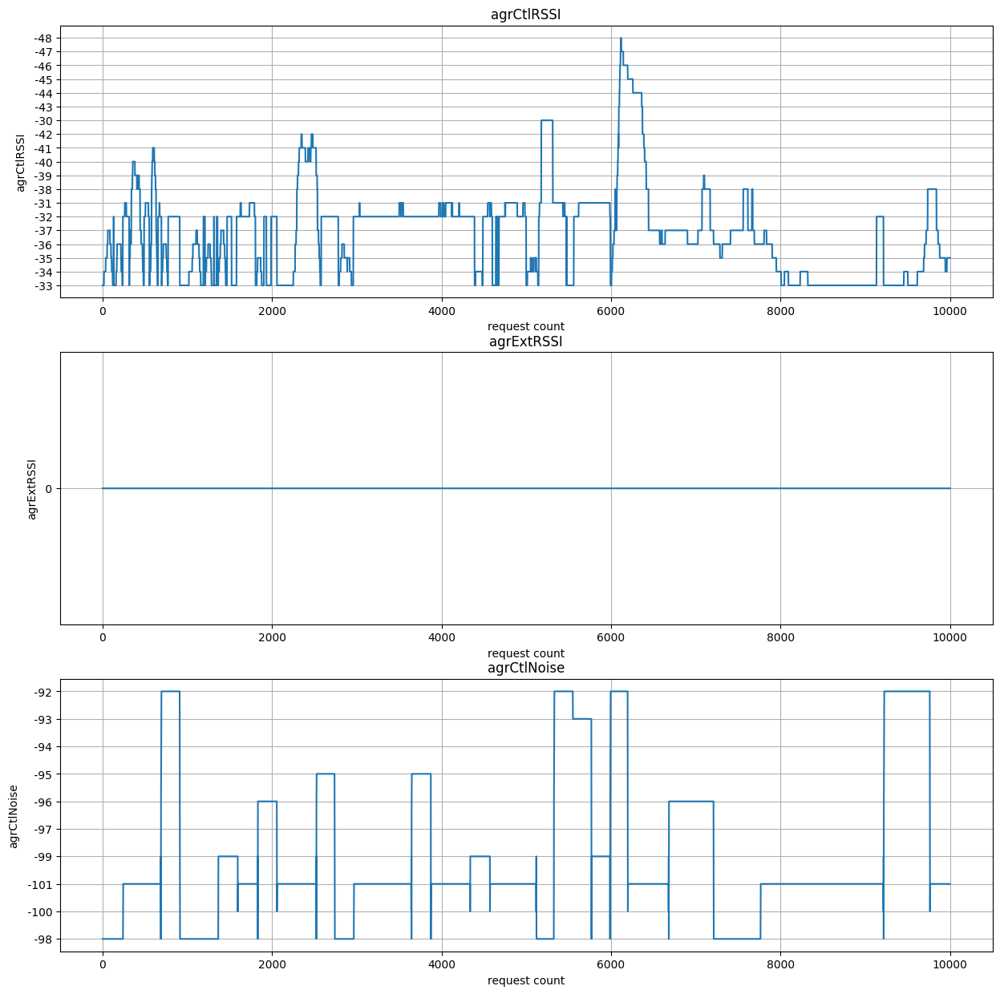

- `agrCtlRSSI`: Kontrol edilen alıcı sinyal gücü seviyesi (RSSI).
- `agrExtRSSI`: Genişletilmiş alıcı sinyal gücü seviyesi (RSSI).
- `agrCtlNoise`: Kontrol edilen gürültü seviyesi.
- `agrExtNoise`: Genişletilmiş gürültü seviyesi.
- `state`: Wi-Fi bağlantısının durumu (örneğin, "running" bağlı demek olabilir).
- `op mode`: İşletim modu (örneğin, "station" kablosuz ağa istemci olarak bağlı olduğunu gösterebilir).
- `lastTxRate`: Son veri iletim oranı.
- `maxRate`: Maksimum veri iletim hızı.
- `lastAssocStatus`: Son bağlantı durumu (0 genellikle başarılı bir bağlantıyı temsil eder).
- `802.11 auth`: 802.11 kimlik doğrulama türü (örneğin, "open" açık bir ağa bağlandığını gösterebilir).
- `link auth`: Link (bağlantı) kimlik doğrulama türü (örneğin, "wpa2" WPA2 kullanıldığını gösterebilir).
- `BSSID`: Erişim noktasının BSSID'si (MAC adresi).
- `SSID`: Erişim noktasının adı (örneğin, "eduroam").
- `MCS`: Modülasyon ve Kodlama Şeması (MCS).
- `guardInterval`: Koruma aralığı süresi.
- `NSS`: Uygun Uzay Sinyali (NSS).
- `channel`: Kullanılan kablosuz kanal numarası.

## To Activate airport

> sudo ln -s /System/Library/PrivateFrameworks/Apple80211.framework/Versions/Current/Resources/airport /usr/local/bin/airport

## Test results



```python

import socket
import struct
import time
import numpy as np

# You can generate an API token from the "API Tokens Tab" in the UI
INFLUXDB_URL = "https://us-central1-1.gcp.cloud2.influxdata.com"
INFLUXDB_TOKEN = 'GENERATED_TOKEN'
INFLUXDB_ORG = "you@domain.com"
INFLUXDB_BUCKET = "main"

from influxdb_client import InfluxDBClient, Point, WritePrecision
from influxdb_client.client.write_api import SYNCHRONOUS

client = InfluxDBClient(url=INFLUXDB_URL, token=INFLUXDB_TOKEN, org=INFLUXDB_ORG)
write_api = client.write_api(write_options=SYNCHRONOUS)

UDP_IP = "0.0.0.0"
UDP_PORT = 5500
SO_TIMESTAMPNS = 35
SOF_TIMESTAMPING_RX_SOFTWARE = (1 << 3)

fx256 = np.ones(256, dtype=bool)
fx256[:6] = False
fx256[64*4-5:] = False
fx256[32] = False
fx256[96] = False
fx256[160] = False
fx256[224] = False
for i in range(1,4):
    fx256[64*i-5:64*i+6] = False


class RX():
    def __init__(self, log=None, poll=None):
        self.r = None
        r = socket.socket(socket.AF_INET, socket.SOCK_DGRAM)
        r.setsockopt(socket.SOL_SOCKET, SO_TIMESTAMPNS, SOF_TIMESTAMPING_RX_SOFTWARE)
        r.setsockopt(socket.SOL_SOCKET, socket.SO_REUSEADDR, 1)
        #r.settimeout(0)
        self.r = r
        r.bind((UDP_IP, UDP_PORT))
        self.fd = r.fileno()

        self.prev = None
        self.send_buf = []

    def recv(self):
        cnt = 0
        last = time.time()
        while True:
            try:
                data, ancdata, _, _ = self.r.recvmsg(4096, 128)
            except socket.timeout:
                continue
            if len(data) < 18:
                print("rx: packet too small")
                continue
            s, ns = struct.unpack('LL', ancdata[0][2])
            ts = s * 10**9 + ns
            self.process(data, ts)
            cnt +=1
            if time.time() - last > 1:
                print('cnt', cnt)
                cnt = 0
                last = time.time()
                self.publish(self.send_buf)
                self.send_buf.clear()

    def process(self, raw, ts):
        self.ver, mask, rssi, fc, mac, _seq, conf, chanspec, chip = struct.unpack('<BBbB6sHHHH',raw[:18])
        seq = _seq >> 4
        mac_str = mac.hex(':')
        count = (len(raw) - 18) // 2
        data = np.frombuffer(raw, dtype='<h', count=count, offset=18).astype(np.float32).view(np.complex64)
        assert len(data) == 256, f"Data of {len(data)} is not expected"
        pl = data[fx256]

        ######simple filter for broken chunks
        x = pl.reshape((4,-1))
        mn = np.mean(np.abs(x), axis=-1)
        msk = np.zeros(mn.shape, dtype=bool)
        msk[np.argmax(mn)] = True
        pl  = x[msk]
        pl = pl.ravel()
        ######################
        #from scipy import signal
        #v = signal.detrend(np.unwrap(np.angle(pl)))

        v = np.abs(pl)
        maxv = np.max(v)
        if maxv != 0:
            v /= maxv

        #DEBUG
        #import matplotlib.pyplot as plt
        #plt.plot(v)
        #plt.show()

        if self.prev is not None:
            motion = (np.corrcoef(v, self.prev)[0][1])**2
            motion = -10 * motion + 10
            self.send_buf.append(dict(time=ts, motion=motion, rssi=rssi,mac=mac_str, seq=seq))
        self.prev = v

    def publish(self, buf):
        points = []
        for b in buf:
            for key in ['motion', 'rssi', 'seq']:
                point = Point("wifi") \
                .field(key, b[key]) \
                .tag("mac", b['mac']) \
                .time(b['time'],WritePrecision.NS)
                points.append(point)
        write_api.write(INFLUXDB_BUCKET, INFLUXDB_ORG, points)


    def close(self):
        self.r.close()


if __name__ == '__main__':
    rx = RX()
    rx.recv()


```

cite:

> [https://www.hackster.io/mzakharo/wifi-sensing-via-raspberry-pi-ff1087](https://www.hackster.io/mzakharo/wifi-sensing-via-raspberry-pi-ff1087)https://www.hackster.io/mzakharo/wifi-sensing-via-raspberry-pi-ff1087
